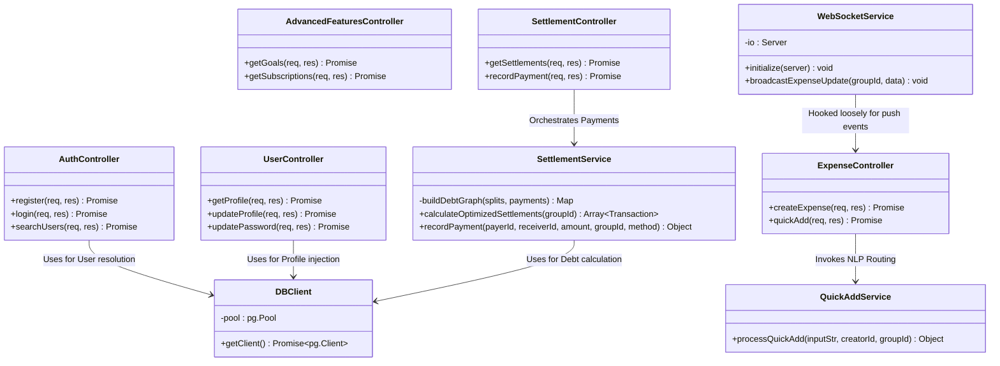
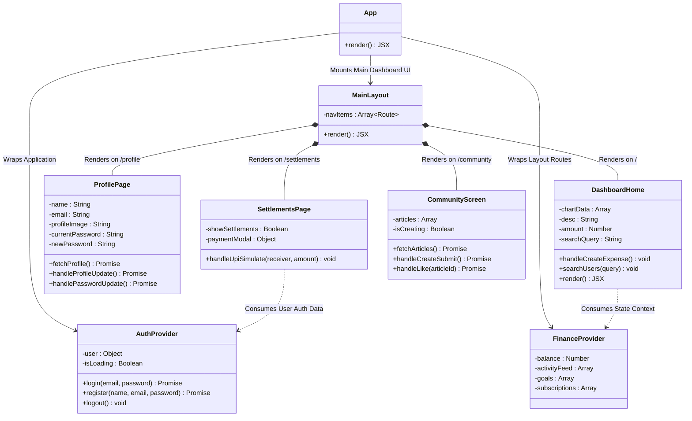

# Pennywise Class Diagrams Detailed

This document provides exact Class Diagrams and structural hierarchies detailing the underlying architecture down to the exact properties and core methods utilized by both the Node HTTP layer and the React Frontend layer.

## 1. Backend Core Domain (MVC/Service Architecture)

The backend follows a distinct Object-Oriented mapping structure. Even though Node.js is function-heavy, the architecture implements ES6 Classes for Controllers and Services to encapsulate explicit dependency states.

### Backend Detailed Class Responsibilities
*   **`SettlementService`:** Central to the business logic. Contains `calculateOptimizedSettlements` which is the O(N log N) graph reduction method that strips out cyclical debts across groups.
*   **`QuickAddService`:** Holds strict `Regex` analysis mapping string queries parsing names/emails into database IDs conditionally.
*   **`DBClient` (Singleton):** Holds the singleton `pg.Pool` instance avoiding connection drops while serving hundreds of concurrent user requests.

---

## 2. Frontend React Component Hierarchy

The frontend relies heavily on Context Wrappers to avoid "prop drilling" state down to child routes, paired with a React Router abstraction mapping explicitly isolated page classes.

### Frontend Detailed Component Responsibilities
*   **`FinanceProvider`:** Acts as the globally scoped Central State Class. It abstracts dummy and live states for arrays including `activityFeed`, `goals`, and `subscriptions` preventing Unmount-Event wipeouts as users click across tabs.
*   **`MainLayout`:** Handles global view wrapping. Computes standard HTML wrappers and ensures CSS resets persist uniformly around dynamically changing `<Outlet />` sub-components. 
*   **`ProfilePage`:** Handles three-tier state execution handling forms independently (Profile text, image parsing natively over browser `` failure catchers, and strict Cryptographic Password hooks).
