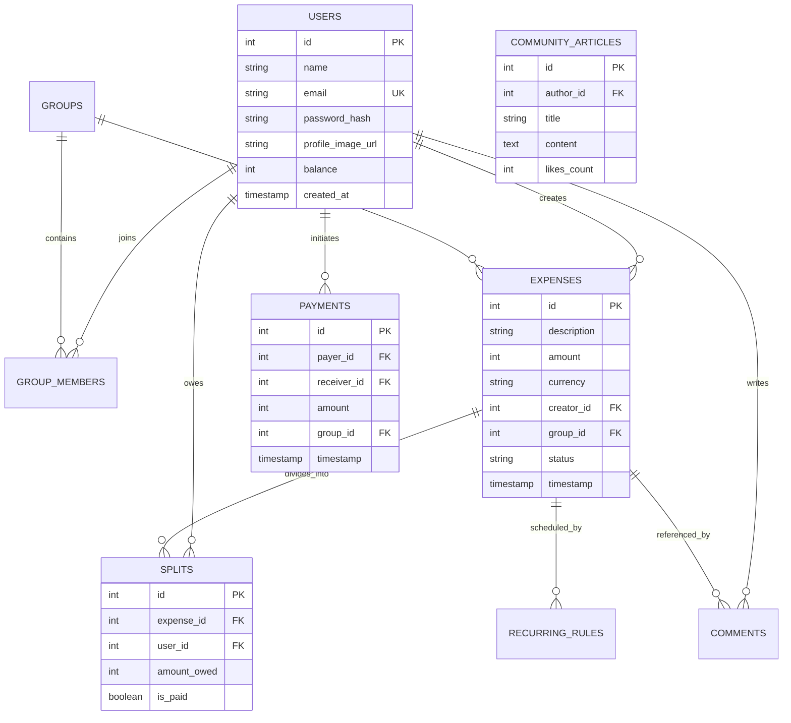

# Pennywise DB: Schema and Architectural Integrity

The primary database utilizes PostgreSQL v14+ adhering strictly to ACID compliance, leveraging Deferred Constraint Triggers for distributed logic validation.

## Entity Relationship Diagram (ERD)

## Advanced Database Features Employed

### 1. Minimal Currency Units
All fiat currencies across the platform are stored strictly as `INT` amounts mapping to the lowest currency denominator (e.g., fractional Paise in INR or Cents in USD). This directly prevents floating-point corruption in JS environments (`0.1 + 0.2 != 0.3000000004`).

### 2. Deferred Trigger Execution
The system maps a `CREATE CONSTRAINT TRIGGER` on the `Splits` table. Whenever `Splits` rows are inserted or updated, it executes a validation pass ensuring the sum of all `<amount_owed>` fields flawlessly equal the parent `Expenses.<amount>`. It is set to `DEFERRABLE INITIALLY DEFERRED` to prevent throwing logical errors dynamically mid-creation before all rows are populated within the transactional block.

### 3. Cascading Deletion
Foreign Keys representing ownership graphs (e.g., `Groups -> Group_Members`, `Expenses -> Splits`) enforce ON DELETE CASCADE constraints. When a parent record is severed, the database automatically cleanses the orphaned leaf nodes, removing the need for sprawling explicit Node.js deletion scripts.
