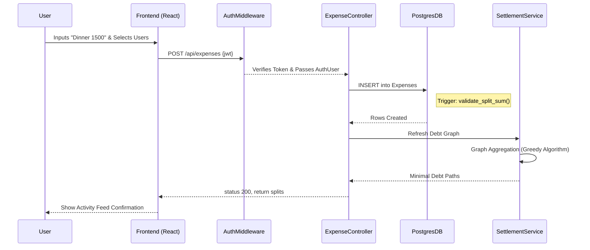
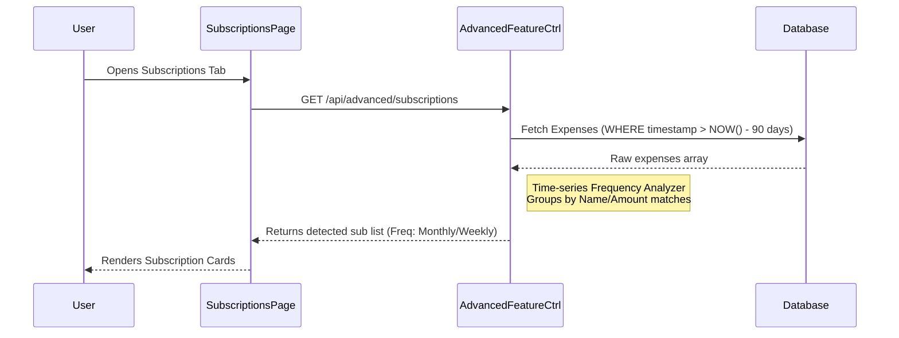

# Pennywise Web: Stakeholders & Use Cases

## Stakeholders Profile

1. **End Users (Individuals/Friends/Roommates):**
   - **Primary Goal:** Track shared expenses, simplify group debts, maintain a community connection regarding financial topics, and effectively monitor individual savings objectives.
   - **Concerns:** Data privacy, ease of expense additions without complex form navigation, accuracy of mathematical settlements (no repetitive payment steps), and UI clarity.

2. **System Administrators:**
   - **Primary Goal:** Retain the uptime of the Postgres instances, monitor WebSocket traffic loads, and handle backend security (JWT management, port binding).
   - **Concerns:** High collision in `Groups_Members` JOIN queries, server bottlenecks on intensive algorithms (O(N log N) settlement compute).

3. **Product Owners / CS305 Project Evaluators:**
   - **Primary Goal:** Verify implementation against standard architectural practices, design patterns (Singleton, MVC), proper API REST schemas, and algorithmic depth (DFS/BFS Graph resolution on Smart Settlements).

---

## Use Cases Detailed

### Use Case 1: Complex Group Expense Settlement
**Actor:** Re-occurring Group Member
**Description:** A user logs in and attempts to submit a complicated shared dinner bill where weights are uneven.
*   **Pre-Condition:** User authenticated via JWT. User is a participant in Group A.
*   **Flow:**
    1. User navigates to Dashboard -> Create Expense.
    2. Enters "Dinner" and "1500", selects participants via AJAX user-search dynamically.
    3. Triggers POST `/api/expenses`.
    4. Backend invokes `ExpenseController.createExpense`, splitting the weights.
    5. Triggers an implicit validation inside `validate_split_sum()` Postgres Trigger to enforce ACID integrity.
    6. Triggers `SettlementService.calculateOptimizedSettlements()` running a Greedy Algorithm mapping the raw Graph debts into minimum spanning paths.
    7. Returns updated Debts.

### Sequence Diagram: Group Expense Settlement

### Use Case 2: Smart AI Subscription Detection
**Actor:** Personal Finance User
**Description:** A user wishes to understand where their leaky monthly wealth goes.
*   **Trigger:** User interacts with the Subscriptions Tab.
*   **Flow:**
    1. Frontend requests `GET /api/advanced/subscriptions`.
    2. Backend queries the last 90 days of expense activity logged recursively by the user.
    3. Controller scans occurrences grouped by absolute string name and sequential time delta thresholds.
    4. Returns array of matched subscriptions flagged as recurring.
    5. User interface paints them with an "AI Detected" Badge in the `<SubscriptionsPage />`.

### Sequence Diagram: Subscription Detection

### Use Case 3: Public Finance Forum Engagement (Community)
**Actor:** Community Contributor
**Description:** A user writes an article about financial independence.
*   **Flow:**
    1. User opens Community Tab.
    2. Inputs article content, tags, and an image URL.
    3. Backend processes `/api/community/articles` routing via `communityController.js`.
    4. Appends standard constraints.
    5. Returns 200 OK.
    6. Other users interact via `/api/community/articles/:id/like` triggering implicit stat updates.
